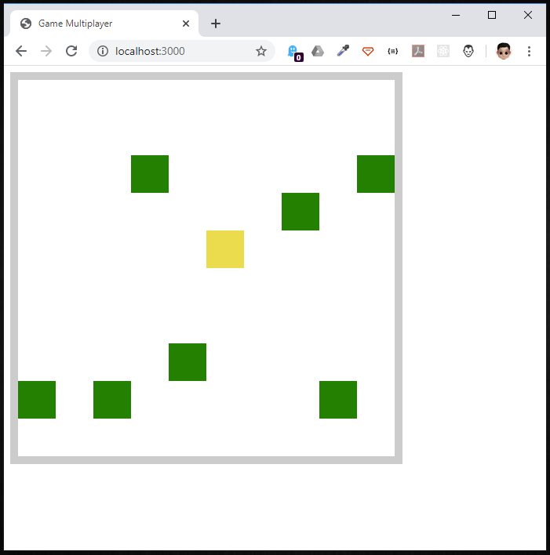
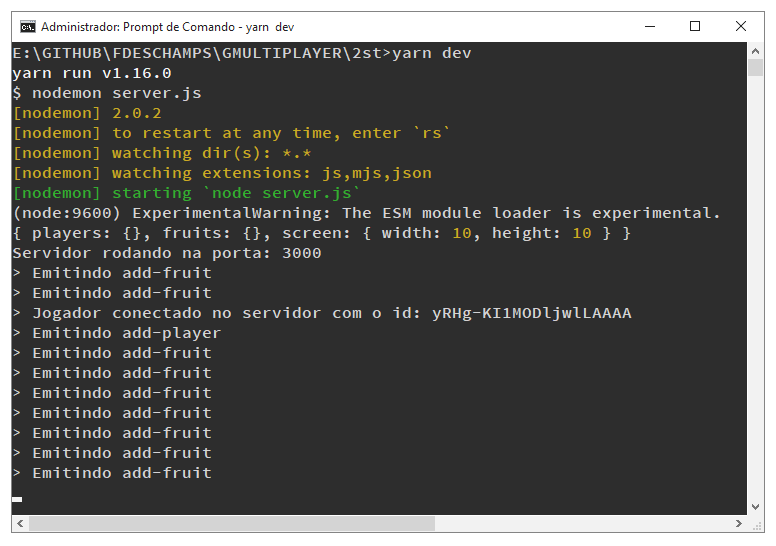

# Jogo Multiplayer

Estudo de jogo multiplayer com Nodejs e socket.io.


 | 

Segue abaixo minhas anotações referente a cada aula.


## Aula 01

Apresentação do projeto.
Neste **game** os jogadores deverão colher o máximo de frutas possíveis.


## Aula 02

**Neuroplasticidade** = Também conhecida como plasticidade neuronal, refere-se à capacidade do sistema nervoso de mudar, adaptar-se e moldar-se a nível estrutural e funcional ao longo do desenvolvimento neuronal e quando sujeito a novas experiências.

1. Projeto = cliente (client/frontend) + servidor (server/backend)
2. Servidor com múltiplos clientes
3. Camadas do jogo:
	
	- [x] 3.1 Apresentação: Parte visual do jogo
	- [x] 3.2 Lógica + Dados: Guarda o estado do jogo e regras
	- [x] 3.3 Inputs: Responsável por receber os comandos do jogador
	- [x] 3.4 NetWorking: Responsável em sincronizar todos os client com o server
	
	**servidor**: NodeJs + Express + Io.Socket
	**cliente**: Html

4. Apresentação de um projeto com servidor e cliente.
5. Game multiplay onde o jogador deve recolher as frutas que aparece no canvas.

### Backend 

Segue de forma simplificada o meu entendimento do jogo.

1. Inicializa o express e o socket.io
2. Executa uma única função createGame()

	* Cria um objeto game{canvas... player..., fruits..., checkForFruit..., clearScore}
	* function addPlayer(socketId)
	* function removePlayer(socketId)
	* function movePlayer(socketId, direction)
	* function addFruit()
	* function removeFruit(fruitId)
	* function checkForFruitColision()
	* function clearScores()
	
3. Cria as Rotas
4. Inicia as conexão com socket.io

	1. (RN) Filtra a qtd máxima de players
	2. (const) armazena o novo player (addPlayer)
	3. (on) Aguarda um direcional ser pressionado
	4. (RN) Valida colisão
	5. (on) desconecta conexão
	6. (on) Começa o jogo e adiciona frutas em um intervalo de tempo
	7. (on) Stop para frutas se pedido 
	8. (on) Habilita o modo crazy
	9. (on) desliga o modo crazy
	10. (on) Limpa Score do jogador
	11. (on) Armazena quantidade de jogadores
	
5. sobre o servidor na porta 3000

### Frontend

Segue de forma simplificada o meu entendimento do jogo.

1. Div com informações.
2. Div com canvas (jogos propriamente dito) e table (informações os últimos 10 jogadores e score)
3. Script:
	(on) Conecta
	(on) Desconecta
	(on) Inicializa o jogo
	(on) Atualiza jogador
	(on) Atualiza score
	(on) movimentação do jogador
	(on) adiciona fruta
	(on) remove fruta
	(on) atualização qtd de jogadores
	(on) habilita modo crazy
	(on) desliga modo crazy
	(on) alerta numero máximo de jogadores
	(on) esconde alerta de numero máximo de jogadores

### Melhorando o código Eslit + Prettier + Editorconfig

Para facilitar o codificação do jogo adicionei o eslint, prettier e editorconfig.

```bash
$ yarn add eslint
$ yarn add prettier eslint-config-prettier eslint-plugin-prettier babel-eslint -D
$ yarn eslint --init

? How would you like to use ESLint? To check syntax, find problems, and enforce code style
? What type of modules does your project use? CommonJS (require/exports)
? Which framework does your project use? None of these
? Does your project use TypeScript? No
? Where does your code run? Node
? How would you like to define a style for your project? Use a popular style guide
? Which style guide do you want to follow? Airbnb: https://github.com/airbnb/javascript
? What format do you want your config file to be in? JavaScript
```

**.eslintrc.js**

```javascript
module.exports = {
  env: {
    commonjs: true,
    es6: true,
    node: true,
  },
  extends: [
    'airbnb-base', 'prettier'
  ],
  globals: {
    Atomics: 'readonly',
    SharedArrayBuffer: 'readonly',
  },
  parserOptions: {
    ecmaVersion: 2018,
  },
  rules: {
    "no-console": "off",
    "guard-for-in": "off",
    "no-restricted-syntax": "off",
    "no-undef": "off",
    "no-shadow": "off",
    "no-return-assign": "off",
    "no-unused-vars": "off",
    "no-use-before-define": "off",
    "func-names": "off",
    "consistent-return": "off",
  },
};
```

**.prettierrc**

```json
{
  "singleQuote": true,
  "trailingComma": "es5"
}
```
​	

## Aula 03

### Hospedar um projeto via SSH

𝗦𝗘𝗥𝗩𝗜𝗗𝗢𝗥 𝗛𝗢𝗦𝗧𝗚𝗔𝗧𝗢𝗥 𝗩𝗣𝗦 45% OFF: http://bit.ly/2MCOyuU

> Dicas para subir servidor usando ssh

```bash
$ mvim ~/.ssh/config
```

**~/.ssh/config**

```
Host hostgator
	User root
	HostName 162.241.55.117
	Port 22022
```

> Conectando via Bash

```bash
$ ssh hostgator
password: xxxxxx
```

> Verificando se a porta 80 está livre

```bash
$ netstat -tulpn | grep :80
```

(*) Caso a porta esteja em uso desabilite o serviço pelo gerenciador de serviço do Hostgator

> Instalando o NodeJS 

https://github.com/nvm-sh/nvm

**Servidor**

```bash
$ curl -o- https://raw.githubusercontent.com/nvm-sh/nvm/v0.35.2/install.sh | bash
$ nvm // Deve responder mostrar alguma coisa
$ nvm ls-remote // lista todas as versões do nodejs
$ nvm install v12.9.0
$ node -v
$ mkdir jogo
$ ls -l
$ cd jogo
$ ls -l
```

>  Copiando os arquivos local para o Server

**Máquina local**

```bash
$ rsync -av --exclude='.git/' . hostgator:./jogo
```

> Executando o game no Servidor

**Servidor**

```bash
$ npm start
```

> PM2 (*)

Gerenciador de processo, vantagem é que se o serviço cair ele sobe novamente.


## Aula 04

### Usando o GitPod

 **Gitpod**: [https://www.gitpod.io/](https://www.youtube.com/redirect?event=video_description&v=Q7YfzbJRzm0&q=https%3A%2F%2Fwww.gitpod.io%2F&redir_token=oJyCImZkXQKD47qHG1ePgKu-QOR8MTU4MTc5NzQ2M0AxNTgxNzExMDYz)

Foi apresentado um ambiente on-line **Gitpod** algo parecido com um container (Docker) ambiente com tudo o que é necessário para rodar o projeto.

## Aula 05

Neste vídeo estudamos o conceito de **Separation of concerns** e partimos para estudar **canvas** no html.

### **Separation of concerns**

A separação de conceitos ou separação de preocupações é um princípio utilizado na computação que visa a preocupação com cada aspecto, modularizadamente. O termo foi cunhado por Edsger W. Dijkstra no seu artigo de 1974 "On the role of scientific thought". Wikipédia

Para executar o projeto em servidor estático.

```bash
$ npx serve
```
### 1. Camada de Apresentação

Criamos um canvas e codamos uma arquitetura simples de dados onde informamos a posição dos jogadores e das frutas.

```html
<!DOCTYPE html>
<html lang="en">
<head>
  <meta charset="UTF-8">
  <meta name="viewport" content="width=device-width, initial-scale=1.0">
  <title>Game Multiplayer</title>
  <style>
    #screen {
      border: 10px solid #ccc;
      /* Não deixa os pixel pixelado */
      image-rendering: pixelated;
      image-rendering: crisp-edges;
      image-rendering: -moz-crisp-edges;
      /* Determina o tamanho do canvas */
      width: 400px;
      height: 400px;
    }
  </style>
</head>
<body>
  <canvas id="screen" width="10" height="10"></canvas>

  <script>
    const screen = document.getElementById('screen')
    const context = screen.getContext('2d')

    const game = {
      players: {
        'player1' : { x: 1, y: 1 },
        'player2' : { x: 9, y: 9 },
      },
      fruits: {
        'fruit1' : { x: 3, y: 1 }
      }
    }

    renderScreen()

    function renderScreen() {
      // Limpando o tela
      context.fillStyle = 'white'
      context.fillRect(0, 0, 10, 10)

      // Camara de Apresentação

      // Renderiza os Jogadores
      for (playerId in game.players) {
        const player = game.players[playerId]
        context.fillStyle = 'black'
        context.fillRect(player.x, player.y, 1, 1)
      }

      // Renderiza as frutas
      for (fruitId in game.fruits) {
        const fruit = game.fruits[fruitId]
        context.fillStyle = 'green'
        context.fillRect(fruit.x, fruit.y, 1, 1)
      }

      // Renderização automática
      requestAnimationFrame(renderScreen)
    }


  </script>
</body>
</html>
```

### Screen

Definimos um cavas de 10(pixel) x 10(pixel) que a principio ficou minúsculo, mas configurar o width e height do mesmo conseguimos um efeito interessante onde o mesmo ficou com ótimo tamanho no navegador e o image-rendering serve para tirar o pixelado.

### requestAnimationFrame()

Sua principal função é chamar um função criando o efeito loop eterno, porem de forma  inteligente. Sempre que nossa estrutura de dados tiver um dado **novo** ou **modificado** ele executa a ultima estrutura de dados.


## Aula 06

Criamos a camada do input do game e adicionamos a primeira regra de negócio onde o player não deve sair do canvas.

### 2. Camada de input

```js
...
const currentPlayerId = 'player1'

const game = {
  ...
}

document.addEventListener('keydown', handleKeydown)

function handleKeydown(event) {
  // console.log(event.key)
  const keyPressed = event.key
  const player = game.players[currentPlayerId]

  if (keyPressed === 'ArrowUp' && player.y - 1 >= 0) {
    player.y -= 1
    console.log('Up')
    return
  }

  if (keyPressed === 'ArrowRight' && player.x + 1 < screen.width) {
    player.x += 1
    console.log('Right')
    return
  }

  if (keyPressed === 'ArrowDown' && player.y + 1 < screen.height) {
    player.y += 1
    console.log('Down')
    return
  }

  if (keyPressed === 'ArrowLeft' && player.x - 1 >= 0) {
    player.x -= 1
    console.log('Left')

  }

}

renderScreen()

function renderScreen() {
  ...
}
```


## Aula 07


### Conceito de Acoplamento (dependência)

Neste vídeo aprendemos sobre **acoplamento** e seu estágios.

Para identificar o acoplamento pergunte-se "De quem é esse código ?" e se atente a resposta.

Entretanto para melhor compreender acoplamento foi dito que existem 3:


> Estágio #1

É quando temos códigos de vários componentes todos ao mesmo tempo.

**Exemplo:**
```
componente(green)

componente(red)
{
	componente(blue)
	{
		componente(green)
	}
}
```

> Estágio #2

É quando apesar de estarem isolados, um componente conhece o outro e o chama forma estática explicita.

**Exemplo**

```
componente(red)
{			
  componente(green)
  componente(blue)			
}			

componente(green)
componente(blue)
```

> Estágio #3

É quando os componentes não se conhecem, nem de forma estática pq não existem declaração ou chamada dentro deles.

**Exemplo**

```
componente(red)

componente(blue)

componente(green)
```


### **Designer Pattern Factory**

É um padrão de projeto de software que permite às classes delegar para subclasses decidirem, isso é feito através da criação de objetos que chamam o método fabrica ... *Wikipédia*

### **Injeção de dependência**

Utilizado quando é necessário manter baixo o nível de acoplamento entre diferentes módulos de um sistema. *Wikipédia*

### **Designer Pattern Observer**

Define uma dependência um-para-muitos entre objetos de modo que quando um objeto muda o estado, todos seus dependentes são notificados e atualizados automaticamente. 
Permite que objetos interessados sejam avisados da mudança de estado ou outros eventos ocorrendo num outro objeto.


> Fases do desacoplamento

1. Isolar a camada do jogo 

	1.1 Criamos um estado inicial que contem "players" e "fruits".

2. Isolar a camada de input 

	2.1 Criamos uma "Factory" createGame() que possui um método movedPlayer que move o player.
	2.2 Criamos um "Observer" que notifica os subscribes qual tecla foi pressionada.

Qual é o beneficio de implementar um Observer ?

Para um ambiente multiplayer o Observer neste exemplo de forma simples notifica todas as máquinas conectadas.

```js
const screen = document.getElementById('screen')
const context = screen.getContext('2d')
const currentPlayerId = 'player1'

const state = {
  players: {
    'player1' : { x: 1, y: 1 },
    'player2' : { x: 9, y: 9 },
  },
  fruits: {
    'fruit1' : { x: 3, y: 1 }
  }
}

// Factory
function createGame() {

  function movedPlayer(command) {
    // command é um objeto
    console.log(`Movendo ${command.playerId} com ${command.keyPressed}`)

    const { keyPressed } = command
    const player = state.players[command.playerId]

	if (keyPressed === "ArrowDown" && player.y + 1 < screen.height) {
      player.y += 1
    }

    if (keyPressed === "ArrowRight" && player.x + 1 < screen.width) {
      player.x += 1
    }

    if (keyPressed === "ArrowUp" && player.y -1 >= 0) {
      player.y -= 1
    }

    if (keyPressed === "ArrowLeft" && player.x -1 >= 0) {
      player.x -= 1
    }
  }

  return {
    movedPlayer,
    state
  }
}

con
```


## Aula 08

> Object literals 

Quando temos muitas condições para verificar, podemos evitar o if e o switch tornando o código mais legível.

> Exemplo:

```js
const calculadora = {
	soma: function(a,b) { return a+b },
}

calculadora.soma 		// (a,b) { return a+b }
calculadora.soma(1,2) 	// 3
```

> Quando usar

Quando tivermos várias situações onde cada uma chama uma função especifica, onde temos só o trabalho de adicionar as novas funcionalidades.


> Codando

```js
  ...
	// Factory
	function createGame() {

		/** @param command -> Object  */
		function movedPlayer(command) {
			console.log(`Jogador ${command.playerId} se movendo com ${command.keyPressed}`)

			const acceptedMoves = {
				ArrowDown(player) {
					console.log('Down')
					if (player.y + 1 < screen.height) {
						player.y += 1
					}
				},
				ArrowRight(player) {
					console.log('Right')
					if (player.x + 1 < screen.width) {
						player.x += 1
					}
				},
				ArrowUp(player) {
					console.log('Up')
					if (player.y -1 >= 0) {
						player.y -= 1
					}
				},
				ArrowLeft(player) {
					console.log('Left')
					if (player.x -1 >= 0) {
						player.x -= 1
					}
				}
			}

			// Recebe a Key pressionada
			const { keyPressed } = command
			// Recebe o state do player com x, y
			const player = state.players[command.playerId]
			// Object Literals
			const moveFunction = acceptedMoves[keyPressed]
			// Executa a funcao continda no acceptedMoves

			if (moveFunction) {
				moveFunction(player)
			}

		}

		return {
			movedPlayer,
			state
		}
	}
	...
```


## Aula 09

Neste video fizemos algumas mudanças mexemos no state inicial do jogo, criamos funções para 
adicionar e remover jogadores e frutas e criar um check para colisão de jogador e fruta.

> State inicial do game

```js
	function createGame() {
		/** Estrutura de dados com o state dos players e fruits */
		const state = {
			players: {},
			fruits: {},
		}
	...
```

> Adicionando Jogar

```js
function addPlayer(command) {
    const { playerId } = command
    const { playerX } = command
    const { playerY } = command

    state.players[playerId] = {
      x: playerX,
      y: playerY
    }
}
```

> Removendo Jogador

```js
  function removePlayer(command) {
    const { playerId } = command

    delete state.players[playerId]
  }
```
> Adicionando Fruta

```js
  function addFruit(command) {
    const { fruitId } = command
    const { fruitX } = command
    const { fruitY } = command

    state.fruits[fruitId] = {
      x: fruitX,
      y: fruitY
    }
  }
```

> Removendo Fruta

```js
  function removeFruit(command) {
    const { fruitId } = command

    delete state.fruits[fruitId]
  }
```

> Algoritmo de Colisão versão inicial

Porem conforme surge novos jogadores e frutas a quantidade de verificação aumenta muito.

```js
	function movedPlayer(command) {
		...
		if (player && moveFunction) {
			moveFunction(player)
			checkForFruitCollision()
		}
	}
	
  function checkForFruitCollision() {
    for (const playerId in state.players) {
      const player = state.players[playerId]

      for (const fruitId in state.fruits) {
        const fruit = state.fruits[fruitId]
        console.log(`Checando ${player} e ${fruit}`)

        if (player.x === fruit.x && player.y === fruit.y) {
          console.log(`Colisão entre ${playerId} e ${fruitId}`)
          removeFruit({ fruitId })
        }
      }
    }
  }
```

> Otimizando a colisão

Neste exemplo removemos um for, informando o jogador conectado.

```js
	function movedPlayer(command) {
		...
		if (player && moveFunction) {
			moveFunction(player)
			checkForFruitCollision(playerId)
		}
	}	
  
  function checkForFruitCollision(playerId) {
		const player = state.players[playerId]

		for (const fruitId in state.fruits) {
			const fruit = state.fruits[fruitId]
			console.log(`Checando ${player} e ${fruit}`)

			if (player.x === fruit.x && player.y === fruit.y) {
				console.log(`Colisão entre ${playerId} e ${fruitId}`)
				removeFruit({ fruitId })
			}
		}
  }
```


## Aula 10

> CommandJS - Sistema de Módulos

Essa estrutura funciona como uma arvore de dependência, onde podemos escolher o que usar.

Exemplo: require("...")

**Bundle**

É nada mais que o codigo Nodejs (CommandJS) no navegador de forma que ele entenda.

**ECMAScript Modules (ESM)**

Comite que padronizou o sistema de módulos no JavaScript.

> Usando import no JS

Para usar um **import** no frontend o <script> precisa ser do tipo module. Ou seja, só um módulo pode chamar outro módulo.

Exemplo:

```html
<html>
	...
	<script type="module">
		import createKeyboardListener from './keyboard-listener.js'
		...
	</script>
</html>
```

```js
// keyboard-listener.js
export default function createKeyboardListener() {
  ...
}
```
> Dependency Injection

Utilizado quando é necessário manter baixo o nível de acoplamento entre diferentes módulos de um sistema.

> Módularizando o Jogo

1. Módulo createKeyboardListener
2. Módulo createGame
3. Módulo renderScreen

No script do client.html (index.html) importamos o 3 módulos.

**(2) Create Game**

Iniciamos o jogo fazendo um createGame() que é responsavel pelo estado inicial (players, fruits e screen) 
e retorna o estado do jogo e algumas funções: addPlayer, removePlayer, movedPlayer, addFruit e removeFruit.

**(1) Create Keyboard Listener**

Executamos a função **subscribe** do createKeyboardListener que trata-se de um "Observer".

Ao executar ```KeyboardListener.subscribe(game.movedPlayer)``` adicionamos no state em observers 
a function movedPlayer(command) de game.js 

Assim que uma tecla é pressionada uma estrutura de dados contendo o nome do jogador e a tecla pressionada
é enviado para o notifyAll

O notifyAll por sua vez com base na estrutra de dados executa o movedPlayer contido no state 

**(3) Render Screen**

Esse módulo recebe 03 parâmetros: screen, game e requestAnimationFrame.

Renderiza todo os jogadores depois todas as frutas.

E como se trata de uma game que possui animação usamos o requestAnimationFrame para criar um loop infinito 
e para renderizar esse loop como estamos em um módulo precisamos dos 03 parâmetros recebidos pelo módulo.


## Aula 11

Preparando o backend o servidor do game.

```bash
yarn add express
yarn add nodemon -D
```

E como vamos usar import no backend a versão do node precisar ser 13 ou superior.
Além disso precisamos editar o packege.json para habilitar o uso do import.
Precisamos adicionar o type = module.

```json
{
  "name": "gmultiplayer",
  "version": "1.0.0",
  "description": "",
  "main": "server.js",
  "type": "module",
  "scripts": {
    "test": "echo \"Error: no test specified\" && exit 1",
    "dev": "node server.js"
  },
  "author": "",
  "license": "ISC",
  "dependencies": {
    "express": "^4.17.1",
    "socket.io": "^2.3.0"
  }
}
```

1. Criando um servidor estático com o Express

> Estrutura de pastas

```bash
/public/index.html
/public/game.js
/public/render-screen.js
/public/keyboard-listener.js
package.json
server.js
```

**server.js**

```nodejs
import express from 'express'
import http from 'http'

const app = express()
const server = http.createServer(app)

app.use(express.static('public'))

server.listen(3000, () => {
  console.log(`Servidor rodando na porta: 3000`)
})
```
2. Testando

```bash
$ yarn dev
```

3. Socket.io

Sempre que o client se conectar ele ira receber todo o estado do jogo, só depois dessa tarefa ele poderar interagir.

```bash
$ yarn add socket.io
```

4. Conectando o Socket.io

**server.js**

```nodejs
...
import socketio from 'socket.io'

const app = express()
const server = http.createServer(app)
const sockets = socketio(server)

...

// Event Emitter
sockets.on('connection', (socket) => {
  const playerId = socket.id
  console.log(`> Jogador conectado no servidor com o id: ${playerId}`)  
})

...
```

**\public\index.html**

```html
<!DOCTYPE html>
<html lang="en">
<head>
  ...
  <script src='/socket.io/socket.io.js'></script>
</head>
<body>
  <canvas id="screen" width="10" height="10"></canvas>
  <script type="module">
    import createKeyboardListener from './keyboard-listener.js'
    import createGame from './game.js'
    import renderScreen from './render-screen.js'

    const game = createGame()
    const KeyboardListener = createKeyboardListener(document)
    KeyboardListener.subscribe(game.movedPlayer)

    const screen = document.getElementById('screen')
    renderScreen(screen, game, requestAnimationFrame)

    // game.addPlayer({ playerId: 'player1', playerX: 0, playerY: 0 })
    // game.addFruit({ fruitId: 'fruta', fruitX: 3, fruitY: 3})
    // game.addFruit({ fruitId: 'fruta1', fruitX: 7, fruitY: 1})
    // game.addFruit({ fruitId: 'fruta2', fruitX: 5, fruitY: 8})

    // assim que conectado devolve um Event Emitter (dp +- observer)
    // são eventos com nome. Ex.: 'connect'
    const socket = io()

    // Conectando no server
    socket.on('connect', () => {
      const playerId = socket.id
      console.log(`Jogador conectado no client com o id: ${playerId}`)
    })
  </script>
</body>
</html>

```

5. Enviando o estado do jogo do server para os clients

Agora vamos enviando o estado do jogo.

**server.js**

```nodejs
...
// Event Emitter
sockets.on('connection', (socket) => {
  const playerId = socket.id
  console.log(`> Jogador conectado no servidor com o id: ${playerId}`)

  socket.emit('setup', game.state)
})
```
**/public/index.html**

```html
<!DOCTYPE html>
...
<body>
  ...
  <script type="module">
    ...
	const socket = io()

    // Conectando no server
    socket.on('connect', () => {
      ...      
    })

    // escutando o evento setup
    socket.on('setup', (state) => {
      console.log(`> Recebendo o estado do Jogo`)
      console.log(state)
    })
  </script>
</body>
</html>
```


## Aula 12

Criamos um método em game para atualizar o state do jogo.

1. setState

**/public/game.js**

```nodejs
export default function createGame() {
  const state = {...}

  function setState(newState) {
    Object.assign(state, newState)
  }	
	
	...
}
```
2. Atualizando o state dos clients

Agora estamos usando o método setState, esse método recebe do servidor o state com as informações do jogo.

**/public/index.html**

```html
<!DOCTYPE html>
<html lang="en">
<head>...</head>
<body>
  ...
  <script type="module">
    ...

    // escutando o evento setup
    socket.on('setup', (state) => {
      console.log(`> Recebendo o estado do Jogo`)
      console.log(state)
			
      game.setState(state)
    })
  </script>
</body>
</html>
```

3. Conectando Jogadores ao servidor

Agora o jogador não está mais marretado. 

(a) Ao fazer a conexão executamos o método **addPlayer** que recebe apenas um parâmetro, o nome do jogador que é o id da conexão do socket.io

(b) Ao fechar o navegador ele remover o jogador, caso recarregue a página ele remover e adiciona novamente.

**server.js**

```nodejs
...
sockets.on('connection', (socket) => {
  const playerId = socket.id
  console.log(`> Jogador conectado no servidor com o id: ${playerId}`)

  // (a)
	game.addPlayer({ playerId })
  console.log(game.state)

  socket.emit('setup', game.state)

	// (b)
  socket.on('disconnect', () => {
    game.removePlayer({ playerId })
    console.log(`> Jogador removido ${playerId}`)
  })
})
...
```
4. Repaginado addPlayer

Antes enviavamos coordenadas fixas do jogador, agora o **addPlayer** gera automaticamente as coordenadas do jogador.

**/public/game.js**

```nodejs
export default function createGame() {
	...
	
	function addPlayer(command) {
    const { playerId } = command
    const playerX  = 'playerX' in command ? command.playerX : Math.floor(Math.random() * state.screen.width)
    const playerY  = 'playerY' in command ? command.playerY : Math.floor(Math.random() * state.screen.height)

    state.players[playerId] = {
      x: playerX,
      y: playerY
    }
  }
}
```

5. Atualizando a posição inicial de todos os jogadores entre os clients

Com o código abaixo o (dp) Observer deixa tudo organizado e pronto para enviar aos clients tudo o que os jogadores estão fazendo.

O array **observer** contem a notificação que será emitida para todos os jogadores.

Os metodos subscribe e notifyAll compõe o dp Observer.

**/public/game.js**

```nodejs
export default function createGame() {
	const state = {...}
	const observers = []
	
  function subscribe(observerFunction) {
    observers.push(observerFunction)
  }

  function notifyAll(command) {
    // console.log(`Notificacao ${state.observers.length} observers`)
    for (const observerFunction of observers){
      observerFunction(command)
    }
  }	
	
	...
	
  return {
    ...
    subscribe
  }	
}
```
6. Notificando a adiçao e removoção de jogadores para os clients

Sempre que um jogador for adicionado ou removido será emitido uma notificação para o servidor, que enviara para os jogadores.

```nodejs
export default function createGame() {	
	...
	
  function addPlayer(command) {
		...
    notifyAll({
      type: 'add-player',
      playerId,
      playerX,
      playerY,
    })
  }	
	
	function removePlayer(command) {
		...
    notifyAll({
      type: 'remove-player',
      playerId,
    })
  }
	...
}
```

7. Recebendo as notificações nos clients.

Agora os jogadores ficam escutanto se algum evento de add-player ou remove-player foi emitido, se houver o método addPlayer e removePlayer e chamado.

```html
<!DOCTYPE html>
<html lang="en">
<head>...</head>
<body>
  ...
  <script type="module">
		...
    socket.on('add-player', (command) => {
      console.log(`Recebendo ${command.type} -> ${command.playerId}`)
      game.addPlayer(command)
    })

    socket.on('remove-player', (command) => {
      console.log(`Recebendo ${command.type} -> ${command.playerId}`)
      // game.removePlayer({ playerId: command.playerId })
      game.removePlayer(command)
    })		
  </script>
</body>
</html>
```

8. Movimentando o jogador

Para movimentar o jogador, primeiro vamos criar no state um playerId que irá identificar o jogador pelo ir do socket.io

Para registrar o jogador criamos uma function registerPlayerId(playerId) que recebe o id e adiciona no state.

Para finalizar adicionamos essa function no return da function createKeyboardListener. 

Ao fazer o primeiro setup do jogo ou receber os primeiro state do jogo enviamos via KeyboardListener.registerPlayerId o parâmetro playerId e registramos no state do keyboard-listener através do subscribe a movimentação do jogador.

**/public/keyboard-listener.js**

```nodejs
export default function createKeyboardListener(document) {
  const state = {
    observers: [],
    playerId: null
  }

  function registerPlayerId(playerId) {
    state.playerId = playerId
  }

	...

  function handleKeydown(event) {... }

  return {
    subscribe,
    registerPlayerId
  }
}
```

**/public/index.html**

```html
	...
	<script type="module">
    ...

    const game = createGame()
    const KeyboardListener = createKeyboardListener(document)

		...        
    socket.on('setup', (state) => {
      const playerId = socket.id    
      game.setState(state)

      // Movimenta o jogador atual
      KeyboardListener.registerPlayerId(playerId)    
      KeyboardListener.subscribe(game.movedPlayer)
    })    
		...
  </script>
...
```

9. Diferenciando a cor do jogador principal

Para diferenciar a cor do jogador corrente adicionamos o item playerId no renderScreen.
Com essa informação no momento de renderizar saberemos que é o jogador corrente.

Além disso mudamos o renderScreen também, agora só renderiza se a conexão for bem succedida.

**/public/index.html**

```html
...
	<script type="module">
		...
		socket.on('connect', () => {
      const playerId = socket.id
      console.log(`Jogador conectado no client com o id: ${playerId}`)

      const screen = document.getElementById('screen')
      renderScreen(screen, game, requestAnimationFrame, playerId)
    })
		...
	</script>
...
```

**/public/render-screen.js**

Para diferenciar o jogado corrente, agora que sabemos o id é só filtrar e mudar a cor.

```nodejs
export default function renderScreen(screen, game, requestAnimationFrame, currentPlayerId) {
	...
	  // Colorindo jogador corrente com uma cor especifica
  const currentPlayer = game.state.players[currentPlayerId]

  if(currentPlayer) {
    context.fillStyle = '#F0DB4F'
    context.fillRect(currentPlayer.x, currentPlayer.y, 1, 1)
  }
	...
}
```

10. Recebendo as coordenados dos outros jogadores.

Começamos alterando a handleKeydown de keyboard-listener.
Adicionamos em command o type: 'move-player' que ira notificar os observers que houve uma tecla pressionada.

```nodejs
export default function createKeyboardListener(document) {
	...
	  function handleKeydown(event) {
    const keyPressed = event.key

    const command = {
      type: 'move-player',
      playerId: state.playerId,
      keyPressed
    }

    notifyAll(command)
  }
	...
}
```
11. No client 

Ao receber o status inicial emitimos para o socket.io um 'move-player' e enviamos um command.

Que enviamos para o server que ao escutar muda o state do jogo.

Toda vez que o game.js for chamado ele também notifica os observers com as novas coordenadas.

No client ficamos escutando o servidor emitir pelo socket.io o 'move-player', assim que ouvir ele verifica se o playerId é igual ao playerId recebido pelo command do move-player se for diferente significa que o outros clients estão se movimentando, então ele atualiza as posições dos adversarios no jogo. Caso contrario significa que o command recebido pelo move-player são as minhas coordenadas, então não precisa fazer nenhuma mudança de coordenada.

**/public/index.html**

```html
...
<script type="module">
	...

	socket.on('move-player', (command) => {
		console.log(`Recebendo ${command.type} -> ${command.playerId}`)

		const playerId = socket.id

		// Filtra se o command recebido é diferente do meu,
		// assim evito duplicar o meu comando no meu player
		if (playerId !== command.playerId) {
			game.movedPlayer(command)
		}
	})

</script>	
...
```

12. Adicinando Frutas para serem colhidas pelos jogadores

Para adicionar frutas criamos o addFruit e removeFruit, assim como o addPlayer e removePlayer eles notificam o serve assim que são invocados.

**/public/game.js**

```nodejs
	...
  function addFruit(command) {
    const fruitId = command ? command.fruitId : Math.floor(Math.random() * 10000000)
    const fruitX = command ? command.fruitX : Math.floor(Math.random() * state.screen.width)
    const fruitY = command ? command.fruitY : Math.floor(Math.random() * state.screen.width)

    state.fruits[fruitId] = {
      x: fruitX,
      y: fruitY
    }

    notifyAll({
      type: 'add-fruit',
      fruitId,
      fruitX,
      fruitY,
    })
  }
	
  function removeFruit(command) {
    const { fruitId } = command

    delete state.fruits[fruitId]

    notifyAll({
      type: 'remove-fruit',
      fruitId,
    })
  }
	...	
```

No client ficamos escutando o add-fruit e remove-fruit assim que ouvidos chamamos eles da camada de jogo.

```html
...
<script type="module">
	...
	socket.on('add-fruit', (command) => {
		console.log(`Recebendo ${command.type} -> ${command.fruitId}`)
		game.addFruit(command)
	})

	socket.on('remove-fruit', (command) => {
		console.log(`Recebendo ${command.type} -> ${command.fruitId}`)
		game.removeFruit(command)
	})
</script>
...
```

Porem até agora as frutas ainda não estão aparecendo no canvas.
Para essa tarefa criamos uma função chamada start, com uma frequencia de 4000ms executa o addFruit.

```nodejs
export default function createGame() {
	...
  function start() {
    const frequency = 4000

    setInterval(addFruit, frequency)
  }
	...
}
```

Para tudo isso funcionar no server.js logo após criar a instancia do createGame() invocamos o game.start()

**/server.js**

```nodejs
...
const game = createGame()
game.start()
...
```