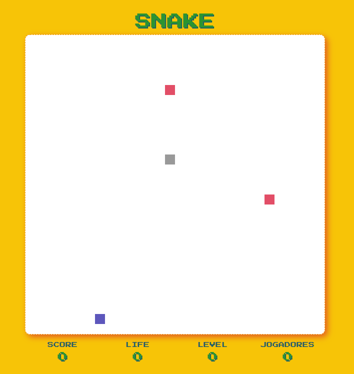
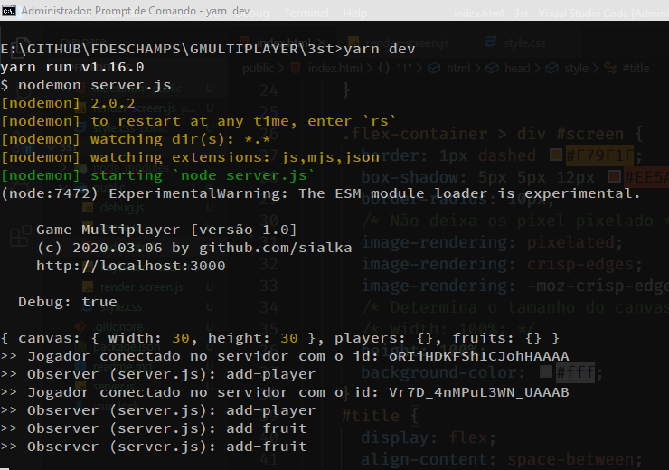

# Game Multiplayer SNAKE

 | 

Este é um game simples multiplayer onde os jogadores deverão recolher o máximo de frutas.

Dando continuidade ao game nesta versão faremos algumas mudanças.

## Novas Funcionalidades

- [x] Novo Layout no canvas
- [x] Adição de palheta de cores
- [x] Ativar/Desativar o modo debug
- [ ] Refatorar Logs no Servidor
- [x] Adição de painel de informação do jogo
- [x] Ativação do score
- [x] Fazer o jogador dar a volta no canvas
- [x] Ativar quantos jogadores estão on-line
- [x] Informar a quantidade de vidas do jogador
- [x] Informar o level (nível de dificuldade)
- [ ] Aumentar o snake assim que ele comer as frutas
- [ ] Ativar colisão com adversário

## Instalação (instruções)

Para jogar faça o download dos arquivos ou clone o repositório.

1. Baixando as dependências

```bash
$ yarn
```

2. Ativando o servidor

```bash
$ yarn dev
```

3. Abra o navegador e digite a url http://localhost:3000
