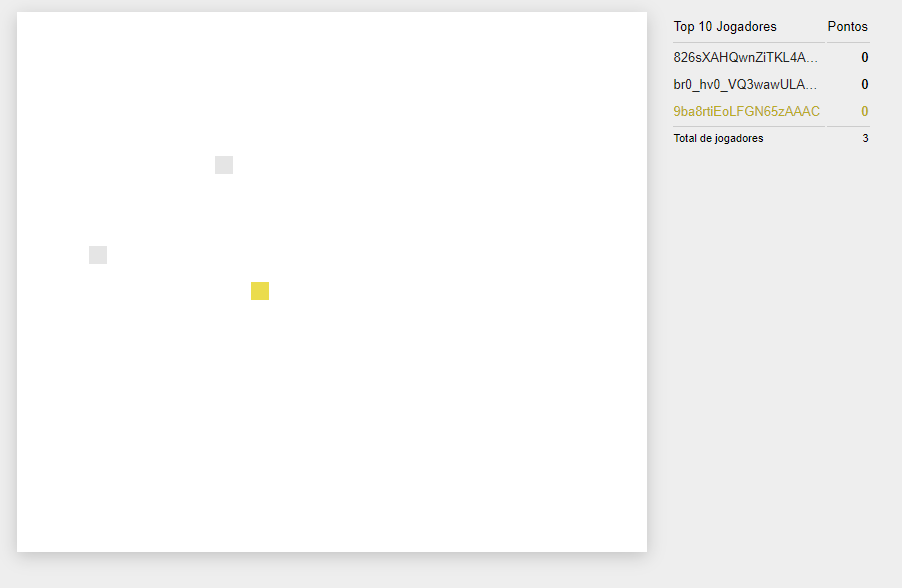

# Jogo Multiplayer

Neste projeto estudei o funcionamento de um jogo multiplayer onde foi usado Javascript + Node.js + Socket.io.



**Start Game**

```bash
$ node server
```

## Playlist Primeiro Jogo Multiplayer

- [x] 1.  Detalhes do Projeto
- [x] 2.  JavaScript + Node.js + Socket.io
- [x] 3.  Hospedar um projeto
- [x] 4.  Gitpod
- [x] 5.  Conceitos importantes
- [x] 6.  Código Mal Feito
- [x] 7.  Acoplamento
- [x] 8.  Object Literals
- [x] 9.  Add/Remove Jogador/Frutas e Checar Colisão
- [x] 10. CommandJS (Sistema de Módulos)
- [x] 11. Express + Http + Socket.io
- [x] 12. Socket.io

## Projetos

### versão original (st1)

Projeto original

### versão de estudo (st2)

Projeto de estudo

### versão nova (st3)

Projeto modificado

## Projeto Original

- **Filipe Deschamps**

https://github.com/filipedeschamps/meu-primeiro-jogo-multiplayer

## Adicional no Projeto st3

- [x] 1. Reajustar o canvas
- [ ] 2. Fazer o "unsubscribe" dos observers
- [x] 3. Sistema de pontuação
- [ ] 4. Emitir Som
- [x] 5. Fazer o jogador dar a volta no canvas
- [ ] 6. Refatorar funções anônimas
- [ ] 7. Filtrar os commandos enviados ao backend
- [ ] 8. Gitpod com versão fixa do Noje.js
